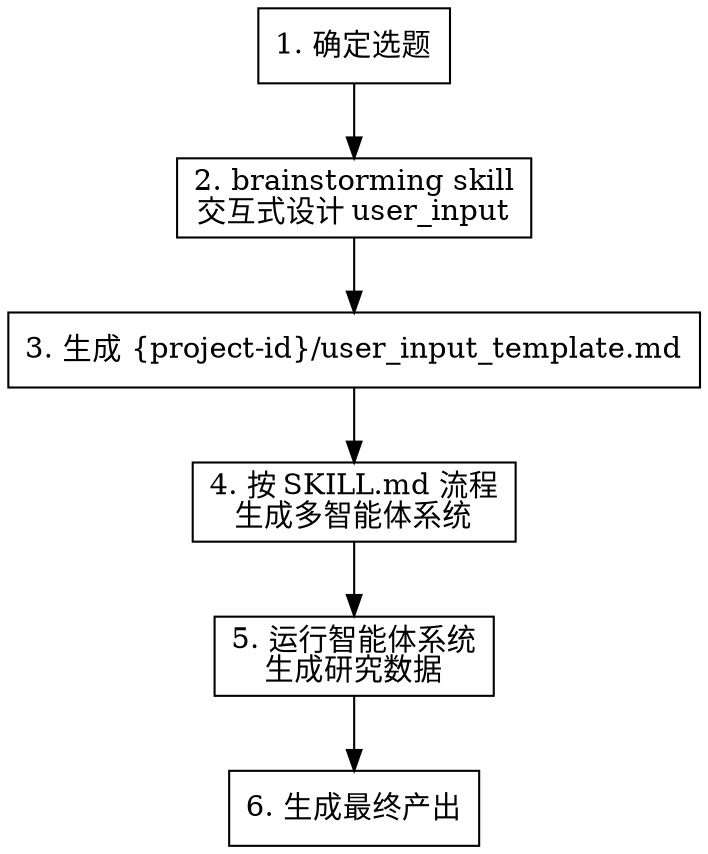

# POMASA Research

基于 POMASA 多智能体生成器框架，完成从选题到研究产出的完整流程。支持多种输出形式：公众号文章、研究报告、技术分析等。

支持在任意目录下调度，自动在用户目录下管理 POMASA 工作空间。

## Phase 0: 环境准备

在执行研究流程之前，必须先完成环境准备。

### Step 0.1: 检测与同步 POMASA 代码库

使用 Bash 执行以下操作：

1. **确定用户主目录**：macOS/Linux 使用 `$HOME`（即 `~`），Windows 使用 `$USERPROFILE`
2. **检查 `~/.pomasa/pomasa/` 目录是否存在**：
   - **不存在**：创建目录并克隆代码库
     ```bash
     mkdir -p ~/.pomasa && git clone https://github.com/neilwangweili/pomasa.git ~/.pomasa/pomasa
     ```
   - **已存在**：拉取最新代码
     ```bash
     git -C ~/.pomasa/pomasa pull origin main
     ```
3. **确认同步成功**：检查 `~/.pomasa/pomasa/skills/pomasa/SKILL.md` 是否存在

### Step 0.2: 确定工作目录

后续所有操作的工作目录为 `~/.pomasa/pomasa/`。所有文件路径均相对于此目录。

## Phase 1: 研究流程



### Step 1: 确定选题

通过 AskUserQuestion 询问用户的选题意向。根据用户输入分两种模式处理：

**模式 A：用户已有明确选题**

用户直接给出了具体的研究主题（如"Cursor 的技术架构分析"、"AI Agent 框架对比"），则直接采纳该选题，进入 Step 2。

**模式 B：用户需要选题辅助**

用户给出的是一段方向性描述（如"最近 AI coding 领域有什么值得深挖的"、"帮我看看 LLM 推理优化方面的动态"），则：

1. 分析用户意图，理解其关注的领域和角度
2. 使用 WebSearch 按用户描述的方向搜索相关内容
3. 整理为 3-5 个候选选题，每个附：
   - **选题名称**：一句话概括
   - **思路（Thought）**：为什么这个选题值得做、可以从什么角度切入、预期能产出什么洞察
4. 使用 AskUserQuestion 让用户从候选中选择，或基于候选进一步调整

### Step 2: 交互式设计 user_input

**调用 brainstorming skill。** 这是一个设计工作：设计的是"如何完成研究并产出成果"的方案，而非成果本身。

brainstorming 的目标是确定 `user_input_template.md` 的各项内容：
- 研究主题与核心问题
- 初步思路与洞察
- 数据来源
- 分析方法
- **输出形式定位**（公众号文章、研究报告、技术分析、对比评测等——需在此阶段明确）
- 模式选择

### Step 3: 生成 user_input_template.md

将 brainstorming 结果写入 `~/.pomasa/pomasa/{project-id}/user_input_template.md`。

`user_input_template.md`中的语言一般使用中文。

如果输出形式定位为**公众号文章**，除非用户特别强调，写作风格部分使用以下默认配置：

```markdown
## 写作风格

**语言**:
- 标准中文，技术术语保留英文
- 专业但不晦涩，有锐度但不偏激
- 短句为主，保持节奏感

**基调**:
- 理性解构，不贩卖焦虑，不说假大空，不神神叨叨
- 数据优先，通过各种论证方式来论证，讲事实，举例子
- 语言以随机性短句式为主，不要长期用同一种语法，风格犀利

**绝对避免**:
- 不写成八卦文
- 不写成科教入门文
- 不用 bullet points 堆砌，用通顺的段落组织（仅在对比数据时可用列表）
- 不反复重复同一观点
- 不用"首先、其次、最后"的机械结构
- 不用夸张修辞和感叹号
- 不贩卖焦虑，不鼓吹末日论
```

根据实际选题和输出形式对风格做适当调整。其他输出形式（研究报告、技术分析等）应在 brainstorming 阶段确定相应的写作风格。

### Step 4-6: 执行 POMASA Generator 完整流程

**必须使用 Task tool 调度一个专门的 agent 来执行完整的 POMASA 流程。**

使用以下参数调用 Task tool：

```
subagent_type: "general-purpose"
description: "Execute POMASA generator workflow"
prompt: "
请严格按照以下步骤执行，不要在任何步骤提前停止：

**工作目录**: ~/.pomasa/pomasa/

**Step 1: 读取用户输入**
阅读 ~/.pomasa/pomasa/{project-id}/user_input_template.md

**Step 2: 读取 POMASA Generator Skill**
阅读 ~/.pomasa/pomasa/skills/pomasa/SKILL.md，理解完整的生成流程

**Step 3: 读取模式目录**
阅读 ~/.pomasa/pomasa/skills/pomasa/pattern-catalog/README.md，了解可用模式

**Step 4: 选择并阅读 Required 模式**
必须阅读所有 Required 模式文档，特别是 BHV-02

**Step 5: 生成智能体系统**
在 ~/.pomasa/pomasa/{project-id}/ 下生成完整的系统文件：
- agents/ 目录及所有 Agent Blueprints
- references/methodology/ 目录及方法论文件
- 其他必需的目录和文件

**Step 6: 运行智能体系统**
按照 agents/00.orchestrator.md 的流程，使用 Task tool 依次调度各个子智能体，生成研究数据到 workspace/ 目录

**Step 7: 生成最终产出**
基于 workspace/ 中的研究数据，按照 output_template 生成最终的文章/报告

**验收标准**：
- 必须完成所有 7 个步骤
- 最终产出文件必须存在于 workspace/ 或 _output/ 目录
- 向我汇报最终产出的完整路径

不要在 Step 5 完成后就停止，必须继续执行 Step 6 和 7。
"
```

**关键点**：
- 使用 Task tool 确保流程不会中断
- 在 prompt 中明确列出所有步骤和验收标准
- 强调不要提前停止

## Phase 2: 结果展示

研究流程完成后，使用 Bash 打开项目输出目录：

- **macOS**: `open ~/.pomasa/pomasa/{project-id}/`
- **Windows**: `explorer %USERPROFILE%\.pomasa\pomasa\{project-id}\`
- **Linux**: `xdg-open ~/.pomasa/pomasa/{project-id}/`

## 关键文件

所有路径相对于 `~/.pomasa/pomasa/`：

| 文件 | 用途 |
|------|------|
| `skills/pomasa/SKILL.md` | MAS 生成器主流程 |
| `skills/pomasa/user_input_template.md` | 用户输入模板 |
| `skills/pomasa/pattern-catalog/README.md` | 模式目录索引 |
